<div dir="rtl">

# سوال اول

## بخش دوم 

شکل زیر نمایش گزارش sonar برای یکی از پروژه‌های داخل سیستم محلی می‌باشد. همانطور که مشخص می‌باشد این کد دارای ۳ خطای smell code می‌باشد. در ادامه به برطرف کردن آنها پرداخته خواهد شد:
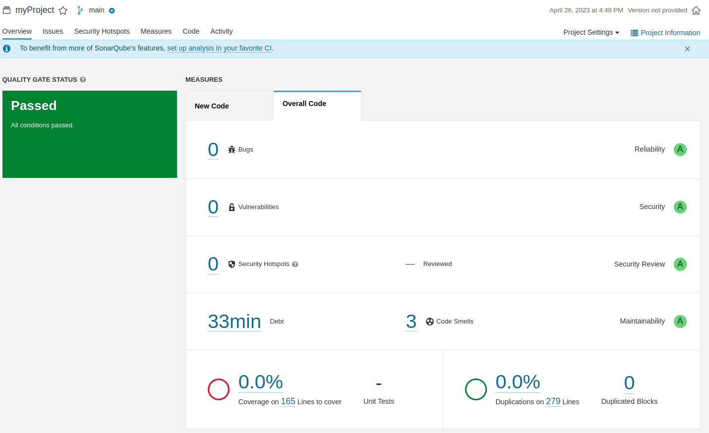

### بررسی code smells اول:
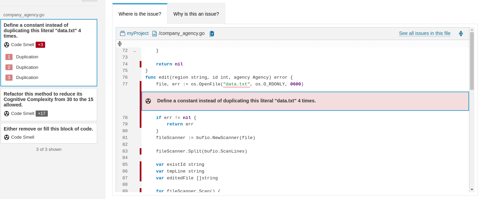
 در اینجا گفته شده است که در طول برنامه چندین بار از مقدار "data.txt" استفاده شده است و بهتر است با تعریف کردن یک const ، از آن به جای این مقدار استفاده شود تا در آینده اگر نیاز به refactor کردن کد وجود داشت، لازم نباشد که در تمام طول برنامه به دنبال این string باشیم و تنها با تغییر مقدار const به هدف خود دست پیدا کنیم. و در واقع fair of change کاهش پیدا کند.

### بررسی code smells دوم:
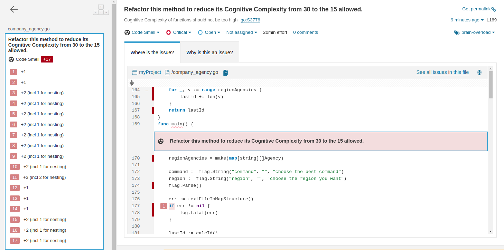
 در اینجا گفته شده است که در Cognitive Complexity کد زیاد می‌باشد، که این می‌تواند فهم جریان برنامه را سخت‌تر کند. و توابعی که دارای پیچیدگی شناختی بیشتری هستند، نگهداریشان دشوارتر است، برای حل این مشکل نیز به دلیل آنکه بخش زیر بارها در کد تکرار شده است، می‌توان تابعی تعریف کرد که عملکرد آن را انجام دهد و تمامی if های مشابه با آن حذف شوند. برای این کار تابع checkErr تعریف شد که با گرفتن interface error عملکرد مورد نظر شرط زیر را انجام می‌دهد و تمامی if های مشابه با ساختار زیر حذف و به جای آنها تابع تازه ایجاد شده فراخوانی شد.

 ```go
if err != nil {
       log.Fatal(err)
   }
```

### بررسی code smells سوم:
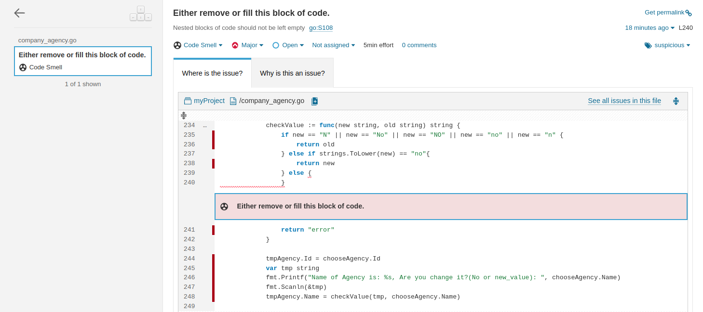
در اینجا داخل بلاک else خالی می‌باشد که به نظر می‌رسد کدی قرار بوده در آن نوشته شود که فراموش شده است، با بررسی مجدد ساختار if بالا متوجه شدم که می‌توان کل ساختار را به صورت زیر بازنویسی کرد و دیگر بلوک خالی نیز نخواهیم داشت.

 ```go
if strings.ToLower(new) == "no" || strings.ToLower(new) == "n" {
    return old
} else {
    return new
}
```
در نهایت پس از بررسی و رفع تمامی code smells ها و اجرای مجدد کد پس از هر بار اصلاح، تمامی موارد برطرف شده و گزارش نهایی به همراه نمودار آن به‌صورت زیر می‌باشد.
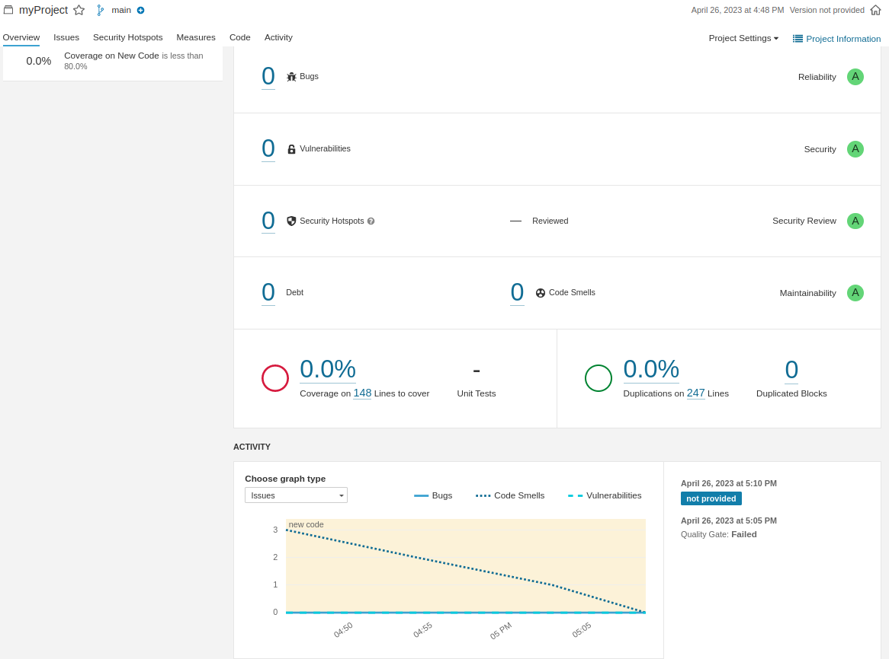

---
<br>

## بخش سوم 
پروژه‌ی انتخابی از لینک قرار داده شده در صورت سوال، در رو به رو آورده شده است:
[لینک پروژه](https://github.com/globocom/secDevLabs/tree/master/owasp-top10-2021-apps/a2/snake-pro)
<br><br>
همانطور که از نتایج اولیه‌ی sonarqube مشخص می‌باشد، برای این پروژه، خطاهای زیر گزارش شده است:

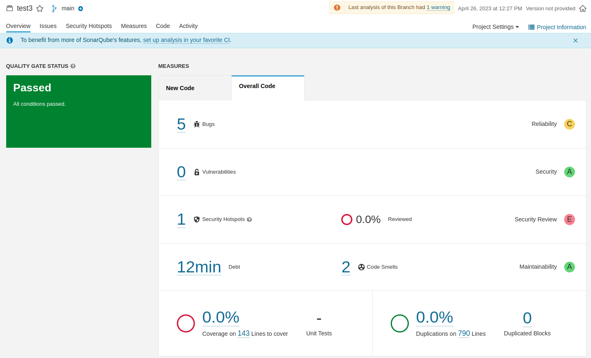

### ابتدا به بررسی باگ‌ها می‌پردازیم:
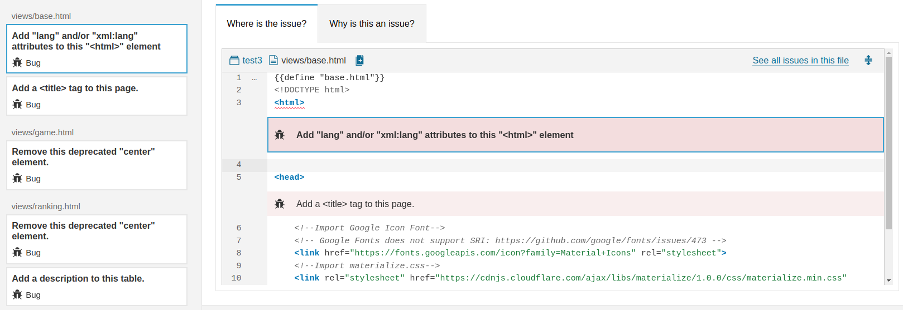
 
باگ شماره‌ی ۱: در این باگ گزارش شده است که ویژگی lang به منظور شناسایی زبان پیش‌فرض یک سند مشخص شود. این کار باعث می‌شود که برنامه‌های دیگری مثل screen reader ها قادر باشند تا به شکل راحت تری صفحه‌ی مربوطه را بخوانند. همچنین به کاربر کمک خواهد کرد تا در صورت استفاده از extension های ترجمه کاربر بتواند تجربه‌ی بهتری داشته باشد و در نهایت rank سایت در موتورهای جستجو را نیز بهتر خواهد کرد.
برای حل این مشکل کافیست <html> را به <"html lang "en> تغییر دهیم.

---
<br>

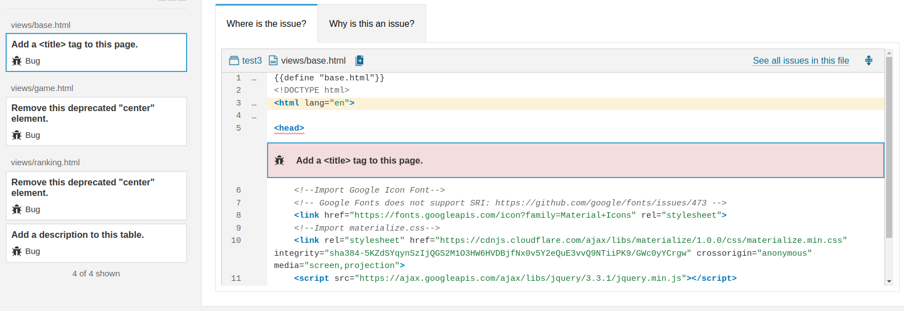
باگ شماره‌ی ۲ : در این باگ گزارش شده است که تعریف تگ title اهمیت دارد چرا که در نتایج موتورهای جستجو و همچنین در نوار بالایی مرورگرها نمایش داده خواهد شد.
برای حل این مشکل کافیست داخل تگ head  تگ مربوط به title را نیز تعریف کنیم ، در واقع به جای  تگ head  قرار دهیم: 

`<head><title>New Title</title>`

---
<br>

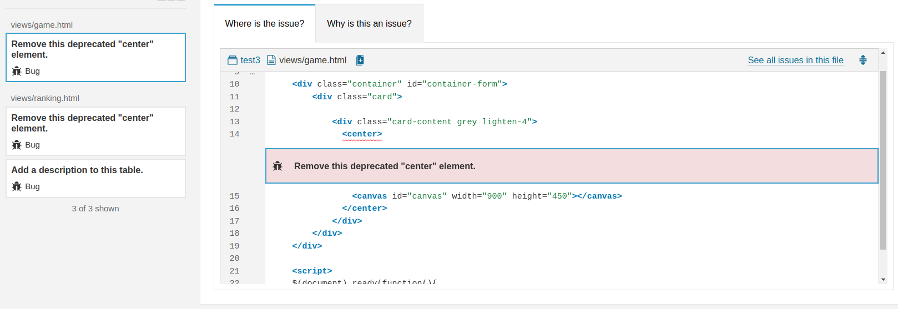
باگ شماره‌ی ۳ :  در این باگ گزارش شده است که در HTML5 بسیاری از تگ‌ها deprecated شده‌اند، و برای اینکه تجربه‌ی کاربری بهتری به ارمغان بیاید ، نباید از تگ های deprecated شده استفاده کرد، بنابراین به جای استفاده از تگ center که deprecated شده است، باید از روش دیگری استفاده کرد.
برای حل این مشکل کافیست به جای استفاده از تگ center باید تگ div را به صورت زیر یادداشت کرد:

`<div class="card-content grey lighten-4" style="text-align:center">
`

---
<br>

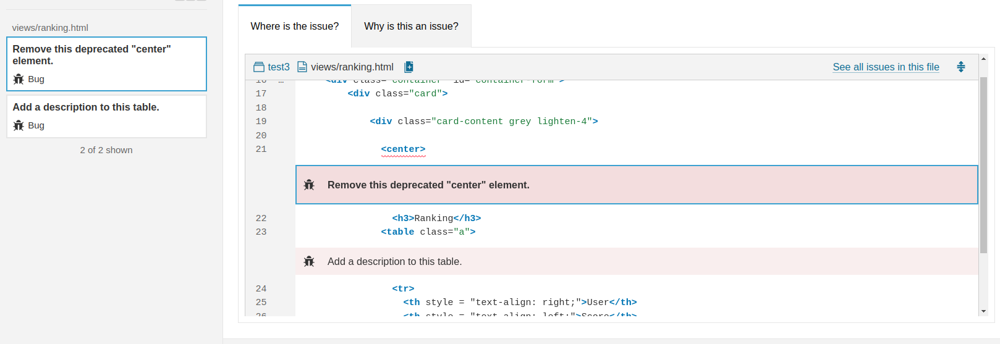
باگ شماره‌ی ۴: این باگ نیز مشابه با باگ شماره‌ی ۳ قابل رفع شدن می‌باشد.
برای حل این مشکل نیز کافیست تگ center را حذف کنیم و تگ div را به صورت زیر بازنویسی کنیم:

`<div class="card-content grey lighten-4" style="text-align:center">
`

---
<br>

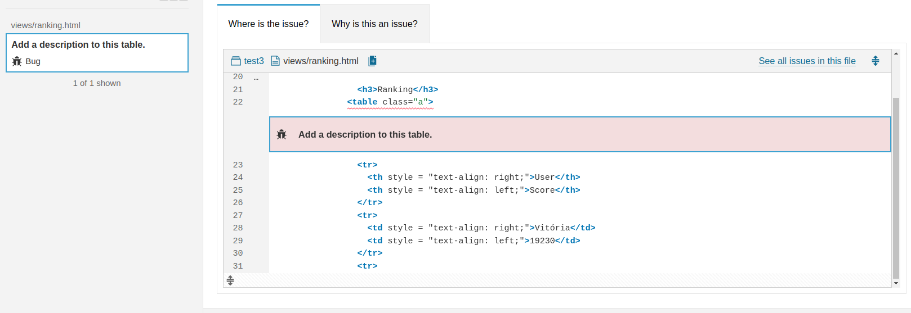
باگ شماره‌ی ۵ : در این باگ نیز گزارش شده است که بهتر است توضیحاتی برای محتوای جداول نوشته شود، و برای این کار یکی از بهترین روشها که توصیه می‌شود، استفاده از تگ caption داخل تگ table می‌باشد.
برای حل این مشکل نیز کافیست تگ caption  زیر را داخل تگ table بنویسیم.

---
<br>

### اکنون به بررسی hotspot security می‌پردازیم:
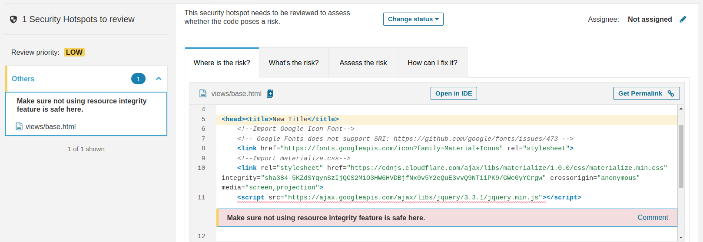
در اینجا گفته شده است که استفاده از منابع خارجی داخل کد و عدم صحت سنجی آنها می‌تواند بر امنیت برنامه اثرگذار باشد، چرا که احتمال دارد منبع خارجی،‌ یک زمانی تغییر کند، که این تغییر می‌تواند خواسته و یا ناخواسته توسط یک مهاجم صورت بگیرد، در این صورت منبع خارجی مورد استفاده در برنامه دیگر منبع اولی نخواهد بود و ضمن این که می‌تواند مخرب نیز باشد، با این توضیح اگر قبل از آوردن محتوا، صحت سنجی انجام شود، میتواند جلو چنین مشکلاتی گرفته شود، بنابراین بهتر است از attribute integrity استفاده شود که با هش گرفتن از محتوای منبع خارجی و تطابق آن با محتوای منبع هنگام دسترسی به آن، در صورت یکسان نشدن محتوا، گنجاندن محتوا در برنامه را مسدود خواهد کرد.
برای حل این مشکل کافیست به جای آنکه در تگ script صرفا از src استفاده شود، ویژگی  integrity هم لحاظ شود، برای این کار کافیست با یکی از الگوریتمهای هش، محتوای منبع خارجی مورد قبول هش شود، و با قرار دادن مقدار هش شده کنار محتوا، صحت‌سنجی منبع قبل از گنجاندن آن در برنامه انجام شود، لذا کافیست هش src ای که در بالا گفته شده را برای نمونه به کمک 
[این سایت](https://www.srihash.org/) بدست آورده و به عنوان مقدار ویژگی integrity در کنار src داخل تگ script پاس بدهیم.


---
<br>

در نهایت پس از رفع باگها و hotspot security گفته شده، نتیجه‌ی گزارش به ‌صورت زیر می‌باشد:

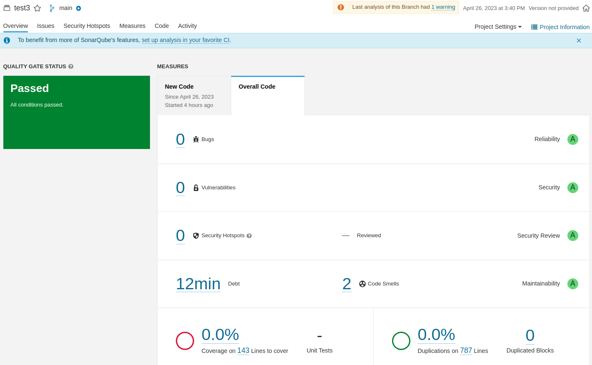
همچنین نمودار نیز پس از رفع هر کدام از باگها و اجرای مجدد کد، به صورت زیر می‌باشد:

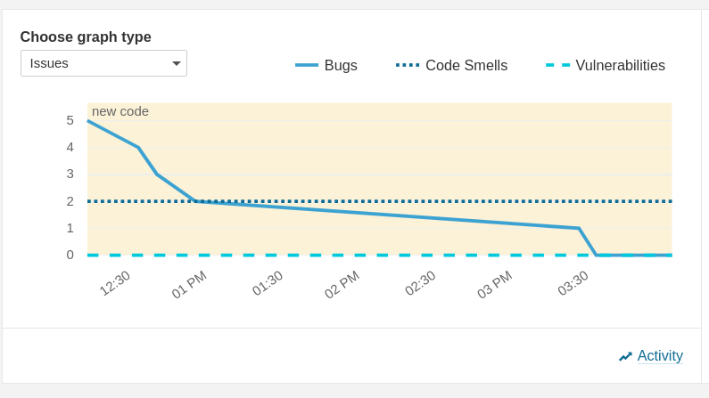

---
<br>

## بخش چهارم 
در گزارشات sonar دو دسته‌ی hotspot security , Vulnerability دارای تفاوت می‌باشند، در hotspot security بخش‌هایی از کد که می‌تواند منجر به آسیب‌پذیری امنیتی شود، مورد توجه قرار می‌گیرد، همانند چیزی که در بالا مشاهده کردیم که گنجاندن یک منبع خارجی، بدون صحت‌سنجی آن می‌تواند منجر به یک آسیب‌پذیری امنیتی شود. و یا به عنوان یک مثال دیگر، اگر password به صورت hard code , plain در کد قرار داده شود، می‌تواند منجر به یک آسیب‌پذیری امنیتی شود.

در مقابل در بخش vulnerability به ضعف های امنیتی برنامه اشاره دارد که بر اسکوپ برنامه اثرگذار است. برای مثال زمانی که شما از http به جای https استفاده می‌کند تا برای مثال اطلاعات user , pass را منتقل کنید، این یک ضعف امنیتی می‌باشد که به راحتی میتواند توسط مهاجم بهره‌برداری شود.

بنابراین باید گفت security hotspot در واقع توجهش به بخش‌هایی می‌باشد که می‌تواند منجر به بروز آسیب‌پذیری شود و در واقع یک خطر بالقوه را شامل می‌شود، حال آن که در vulnerability به بخش‌هایی از برنامه توجه دارد که عملا دارای یک ضعف امنیتی هستند و در واقع خطراتی هستند که بالفعل بوده و مهاجم میتواند به راحتی از آنها بهره‌برداری کند.

# سوال دوم

</div>
