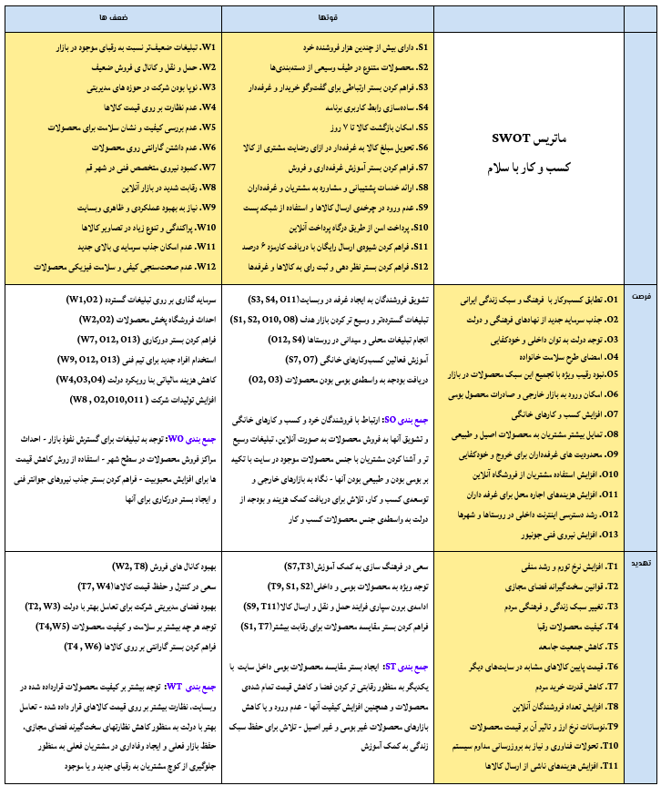
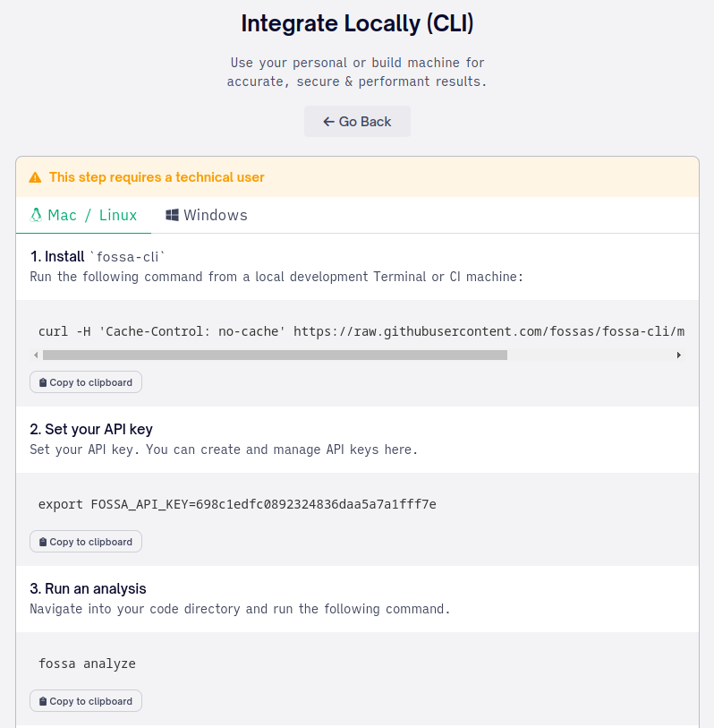
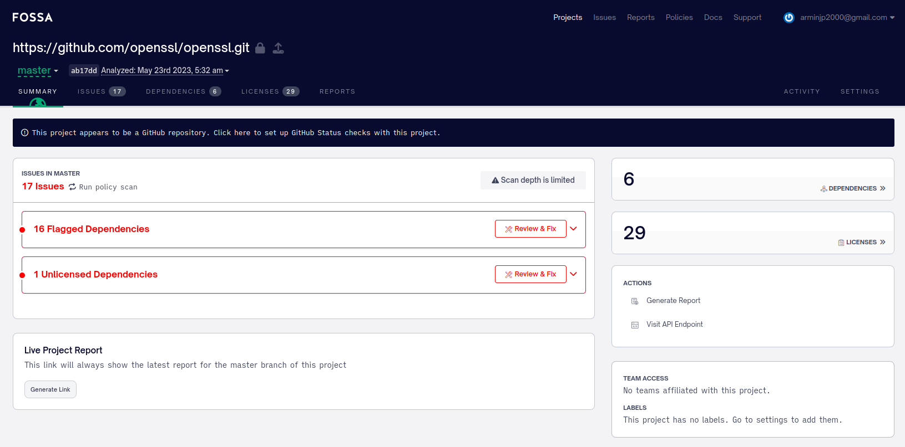

# بخش اول
## سوال اول
ماتریس SWOT یا همان ماتریس قوت ، ضعف ، فرصت ، تهدید ، یکی از بهترین ابزار برای تحلیل محیط و استخراج استراتژی های متناسب با شرکت می‌باشد ، در این جا روش کلی به این صورت است که عموما مدیرانی که در حال انجام برنامه استراتژیک در شرکت هستند ، تطابق هایی را باید میان هر یک از این عوامل پیدا کنند، نتیجه ی این تطابق ها چهار ناحیه ی مختلف را در این ماتریس تعیین خواهد کرد:
- ناحیه‌ی SO که در آن استراتژی هایی که در پی استفاده از فرصتها هستند و با توجه به قوت های سازمان انتخاب می‌شوند.
- ناحیه‌ی WO که در این ناحیه استراتژی هایی برای غلبه بر ضعف های سازمان به کمک فرصت های موجود تعیین خواهند شد.
- ناحیه‌ی ST که در این ناحیه شرکت استراتژی هایی را انتخاب خواهد کرد تا به کمک نقاط قوت خود ، خطر تهدیداتی که شرکت را تهدید می‌کند به کمترین مقدار ممکن برساند.
- ناحیه‌ی WT که استراتژی های کاملا دفاعی ، که مانع آسیب رسیدن به شرکت می‌شوند به علت ضعف ها و تهدیدات موجود ، انتخاب خواهند شد.

تصویر این ماتریس به شکل زیر می‌باشد :

## سوال دوم
تحلیل PESTLE در اثر تاثیر بیماری کوید ۱۹ بر شرکت‌های حوزه‌ی گردشگری

از لحاظ سیاسی : لازم به ذکر است در امور سیاسی مواردی همچون قانون کار ، قانون تجارت ، تعرفه ها و مقررات ، چگونگی روابطی خارجی ، قدرت گروه های سیاسی مختلف و چگونگی ثبات دولت مطرح می‌شوند. به واسطه‌ی بیماری کرونا بسیاری از اقدامات دولت برای کاهش این بیماری، تاثیرات منفی ای را بر بسیاری از شرکتهای حوزه‌ی گردشگری گذاشت، برای مثال مواردی همچون اعمال قرنطینه خانگی، ایجاد محدودیت برای سفرهای برون شهری و برون کشوری، الزام تست کویید برای استفاده از وسایل حمل و نقل بین شهری و… از اقداماتی هستند که همگی می‌توانند تاثیر مخربی را بر شرکت‌هایی که در حوزه‌ی گردشگری هستند وارد کند، بنابراین به عنوان تحلیل عوامل بیرونی می‌توان تاثیر ملاحظات و اقدامات سیاسی در اثر بیماری کرونا را بر شرکت‌های حوزه‌ی گردشگری منفی در نظر گرفت.

از لحاظ اقتصادی ، مواردی که می‌توان بررسی کرد ، نرخ تورم ، تحریم ها ، تعرفه و قوانین گمرکی بر روی کالای وارداتی و رشد اقتصادی کشور می‌باشد ، با این توضیح به واسطه‌ی حضور بیماری کرونا، شرایط اقتصادی بسیاری از کشورها من جمله کشور ایران با مشکلات بزرگی مواجه شد و رشد اقتصادی بسیاری از کشور ها کاهش پیدا کرد و مشکلات اقتصادی در این مدت افزایش پیدا کرد، شرکت‌های حوزه‌ی گردشگری نیز مانند بسیاری از این کسب و کارها به دلیل آنکه توان اقتصادی مردم در این مدت کاهش داشت، مراجعات بسیار کمتری را نسبت به زمان‌های مشابهی که کرونا حضور نداشت تجربه کردند، و این شرکت ها در این مدت با مشکلات متعددی مواجه شدند، بنابراین از لحاظ اقتصادی به عنوان یک پارامتر بیرونی، می‌توان گفت به طور کلی بیماری کرونا باعث بروز مشکلات متعدد اقتصادی شد، که همین امر باعث می‌شود که تاثیر این پارامتر را در شرکت‌های حوزه‌ی گردشگری نیز منفی قلمداد کنیم.

از لحاظ اجتماعی و فرهنگی ، در این دسته مواردی مثل جمعیت شناسی مصرف کنندگان ، شامل سن افراد ، جنسیت ، و حوزه ی جغرافیای آن ها  ، چگونگی عادات و علایق، وضعیت سطح زندگی،وضعیت فرهنگ و علاقه از عواملی هستند که مورد بررسی قرار می‌گیرند ، می‌توان گفت در اثر بیماری کرونا شاید تعداد اندکی از موارد بالا با تغییر مواجه شدند، برای مثال می‌توان گفت سبک زندگی افراد بیشتر به سمت فضای مجازی و استفاده از خدمات الکترونیکی پیش رفت، که همین میتواند خود باعث تغییر عادات و علایق و سلیقه‌های افراد در بلند مدت شود، با این توضیح شاید در زمان حضور کرونا تاثیر چندانی را از لحاظ اجتماعی نمی‌توان برای شرکت‌های حوزه‌ی گردشگری در نظر گرفت، اما با کاهش بیماری کرونا، و تغییر عادات مردم و تمایل بسیار زیاد آنها برای انجام سفر و تفریح، می‌توان دوران کم‌رنگ شدن کرونا را دوران رشد شرکت‌های گردشگری دانست، بنابراین به طور کلی شاید از لحاظ اجتماعی و فرهنگی می‌توان تاثیر کرونا را بر شرکت‌های حوزه‌ی گردشگری، یک تاثیر مثبت قلمداد کرد.

از لحاظ تکنولوژیک ، می‌توان به چگونگي سطح درآمد بين اقشار مختلف جامعه و روند آن ، جهت جريان سرمايه و نيرو كار در سطح ملي ، جهت گيري سياست هاي اقتصادي دولت ، برنامه هاي توسعه در سطح ملي ، سطح تكنولوژي و روند تغييرات آن در كشور و جهان اشاره کرد ، همانطور که مشخص است بخش عمده ای از این حوزه نیز دست دولت و سیاست های آن می‌باشد ،  با این توضیح با حضور کرونا، رشد استفاده از تکنولوژی بسیار تسریع پیدا کرد، شرکت‌های حوزه‌ی گردشگری شاید در نگاه اول با تاثیر مستقیمی مواجه نباشند، اما شرکت‌هایی که فعالیت خود را به صورت الکترونیکی هم دنبال کردند، قطعا با تاثیرات مثبتی مواجه بودند، بنابراین نقش بیماری کرونا در شرکت‌های حوزه‌ی گردشگری، را در صورتی که این شرکتها در این مدت با تکنولوژی درگیر و یا فعال بوده‌اند می‌توان مثبت در نظر گرفت و اگر این شرکت‌ها چندان در این حوزه فعال نبوده‌اند، می‌توان منفی در نظر گرفت چرا که رقبای آنها که فعالیت به صورت مجازی را دنبال کرده‌اند، قطعا از این فرصت ایجاد شده استفاده کرده‌اند. 

از لحاظ محیطی و محیط زیست ، عواملی همچون شرایط محیط مثل خشکسالی ها از این موارد هستند، شاید حضور کرونا را نیز بتوان به نوع یک عامل محیطی در نظر گرفت که به طور کلی باعث مشکلات متعددی برای بسیاری از افراد و سازمانها شد، بنابراین  به طور کلی از لحاظ محیطی و محیط زیست می‌توان نقش کرونا بر شرکت های حوزه‌ی گردشگری را منفی در نظر گرفت. 

از لحاظ قانون ، در این بخش قوانین مختلفی که بر کشور و به خصوص صنعت گردشگری مطرح می‌باشد ،‌ بررسی می‌شود ، قوانینی که ممکن است سال ها تغییر نکند و یا قوانین که ممکن است برای حقوق مصرف کننده و یا تولید کننده توسط مجلس وضع شوند ، اما به طور کلی با توجه به سیاست های کشور عموما قوانین به طور ناگهانی تغییر نمی‌کنند و شرکت ها توانایی وفق دادن خود با شرایط جدید را پیدا می‌کنند ، مگر آنکه دولت ها تصمیماتی عجولانه لحاظ کنند ، که تاثیر کرونا و به دنبال آن تصمیمات ناگهانی دولت‌ها را می‌توان کاملا منفی در نظر گرفت، چرا که قوانینی که به واسطه‌ی بیماری کرونا وضع شد در تمامی حوزه‌ها به ویژه حوزه‌ی گردشگری، تاثیر مستقیمی را به دنبال داشت، و شرکت‌های حوزه‌ی گردشگری از این قضیه در امان نبوده اند.

## سوال سوم
رویکردهای مدیریتی استاندارد ISO 27001 را در یک نگاه کلی می‌توان شامل سه مرحله اصلی به شرح زیر برشمرد:

1. برنامه ریزی: در این مرحله، شناسایی و تحلیل خطرات امنیتی، جمع‌آوری و مدیریت پروسه‌های داده‌ها و نیازهای قانونی و مشتری صورت می‌گیرد. این مرحله شامل سه فعالیت اصلی است: تعیین ریسک، تعیین الزامات در مورد امنیت اطلاعات و تعیین چارچوب برنامه‌ریزی برای پیاده‌سازی استاندارد ISO 27001 است
2. پیاده سازی: در این مرحله، استانداردهای امنیتی ISO 27001 پیاده سازی می شود. این مرحله شامل اجرای سیاست های امنیتی و رویه های کنترلی، طراحی و پیاده سازی سیستم های امنیتی، برنامه ریزی و اجرای آموزش های امنیتی برای کارکنان و غیره می باشد.
3. بررسی و ارزیابی: در این مرحله، عملکرد سیستم های امنیتی ISO 27001 بررسی و ارزیابی می شود. این مرحله شامل مراجعه به لیست ضوابط کنترلی (ISMS) استاندارد ISO 27001، ارزیابی تأثیر در ظرفیت های فنی و اقتصادی، مرور و ارزیابی سیاست ها و رویه های کنترلی و غیره می باشد.

به طور خلاصه، استاندارد ISO 27001 یک الگوی مدیریت امنیت اطلاعات را ارائه می دهد که شرکت ها و سازمان ها می توانند از آن استفاده کنند تا محیطی امن و پایدار برای اطلاعات خود فراهم کنند. برای پیاده سازی استاندارد ISO 27001، باید ابتدا برنامه ریزی شده و سپس اجرای مناسب و بررسی نتایج صورت گیرد.
اما به صورت دقیق تر باید گفت رویکردهای مدیریتی استاندارد ISO 27001 شامل چندین عملیات و فعالیت می باشد که در زیر به توضیح بیشتری درباره آنها خواهم پرداخت:

1. تعیین سیاست ها و هدف‌های امنیتی: این مرحله شامل تعیین سیاست ها و هدف‌های امنیتی برای سازمان می باشد. در این فرآیند، باید مراحلی مانند تعیین اصول امنیتی، مقررات قابل اجرا، نیازهای گروه های داخلی و خارجی و غیره را مورد بررسی قرار داد.
2. تحلیل ریسک: این فعالیت شامل شناسایی، ارزیابی و به حداقل رساندن ریسک‌های احتمالی است. در این مرحله، باید مشخص شود که چه چیزهایی می توانند باعث تهدید امنیتی فضای کار کردند و سپس پلن‌هایی برای کاهش این تهدیدات را طراحی و پیاده سازی کرد.
3. طراحی و اجرای کنترل‌های امنیتی: در این مرحله کنترل های امنیتی برای جلوگیری از وقوع خطاهای احتمالی، حملات سایبری و سایر تهدیدات امنیتی طراحی و پیاده سازی می شود. شامل طراحی ساختار سیستم های امنیتی، تعیین نرم‌افزارها می‌باشد.
4. آموزش و آگاهی دهی: آموزش و آگاهی دهی به کارکنان درباره سیاست ها، رویه ها و کنترل های امنیتی یکی از روش‌هایی است که در این استاندارد مورد تاکید قرار گرفته است. این فعالیت شامل آموزش کارکنان درباره تهدیدات امنیتی سایبری، رویه های امنیتی و رفتار مناسب در مواجهه با این تهدیدات است.
5. نظارت و بررسی: نظارت و بررسی مستمر بر فعالیت های سیستم امنیتی برای تشخیص و رفع خطاها و داشتن یک سیستم پاسخگویی سریع در مقابل تهدیدات امنیتی از جمله عملیات ضروری است. در این مرحله، باید ارزیابی کنترل های امنیتی، حفظ سطح امنیتی و گزارش دهی در مورد نتایج انجام شده به صورت دوره‌ای انجام گیرد.

به عنوان یک دسته‌بندی جزیی‌تر نیز می‌توان رویکردهای مدیریتی را به بخش‌های زیر تقسیم کرد:

1. تعیین دامنه (Scope) استاندارد: در این مرحله، باید تعیین شود که با چه بخش‌هایی از سازمان استاندارد ISO 27001 پوشش داده خواهد شد.
2. تعیین ریسک‌ها:این مرحله شامل شناسایی و ارزیابی ریسک‌های مختلف از جمله تهدیدات احتمالی، آسیب‌های احتمالی و ضعف‌های امنیتی می‌باشد.
3. تعیین الزامات: در این مرحله، بر اساس ریسک‌های مشخص شده، الزامات امنیتی برای سازمان تعیین می‌گردد.
4. طراحی و پیاده‌سازی الزامات: در این مرحله، بر اساس الزامات تعیین شده، سیاست‌ها، رویه‌ها و نرم‌افزارهای لازم برای اجرای آن‌ها طراحی و به کار گرفته می‌شود.
5. آموزش و آگاهی دهی: آموزش و آگاهی دهی کارکنان درباره سیاست‌ها، رویه‌ها و نرم‌افزارهای امنیتی در صورت پیاده‌سازی آن‌ها، برای دستیابی به اهداف استاندارد ضروری می‌باشد.
6. نظارت و بررسی: برای مانیتورینگ و ارزیابی کارکرد سیستم‌های امنیتی و همچنین شناسایی نقاط ضعف و بهبود هموار نظام‌های امنیتی، باید نظارت و بررسی انجام گیرد.
7. بازبینی: در این مرحله، بازبینی و بررسی سیستم‌ها و رویه‌های امنیتی اجرایی شده به منظور تأیید وضعیت امنیتی و همچنین گزارش‌دهی به مدیران صورت می‌گیرد.

همچنین باید توجه داشت که رویکردهای مدیریتی این استاندارد را اگر خاص بخش مدیریت در نظر بگیریم، می‌توانیم به دسته بندی زیر نیز اشاره کنیم:

1. مدیریت خطر: شامل شناسایی، ارزیابی، کنترل و پایش خطرات امنیتی در سازمان است.
2. مدیریت امنیت فیزیکی: شامل کنترل دسترسی به فضاهای فیزیکی سازمان، مانند ساختمان، اتاق سرورها و غیره است.
3. مدیریت دسترسی: شامل مدیریت دسترسی کاربران به منابع سیستم و شبکه سازمان است.
4. مدیریت امنیت شبکه و سیستم‌ها: شامل پیکربندی و مدیریت امنیت شبکه و سیستم‌های سازمان است.
5. مدیریت امنیت نرم‌افزاری: شامل مدیریت امنیت نرم‌افزارهای سازمان، از جمله نرم‌افزارهای مورد استفاده در پردازش داده‌ها و سرویس‌های وب 
6. مدیریت حریم خصوصی: شامل مدیریت داده‌های حساس و حریم خصوصی کاربران و اطلاعات شخصی آن‌ها در سازمان است.
7. مدیریت آموزش و آگاهی: شامل آموزش کارکنان سازمان در زمینه امنیت اطلاعات و ایجاد فرهنگ امنیتی در سازمان است.

در نهایت مواردی که به آنها به عنوان رویکردهای مدیریتی مختلف اشاره شد همگی صحبت‌های یکسانی هستند در قالب‌های مختلف و با جزییات مختلف نسبت به موضوع.

# بخش دوم
## سوال اول
برنامه‌ی FOSSA یک ابزار تجزیه و تحلیل نرم افزار است که به طور مداوم اجزای کدهای منبع باز را اسکن می کند و به بررسی وابستگی ها و انطباق مجوزها می‌پردازد. از طرفی می‌توان برنامه‌ی FOSSA را یک ابزار مدیریت و بررسی کدهای منبع باز دانست. این برنامه به صورت خودکار به بررسی کدهای پروژه‌های نرم‌افزاری اقدام می‌کند تا به کشف هرگونه ایراد در کد و خطاهای احتمالی کمک کند. همانطور که گفته شد، FOSSA به تجزیه و تحلیل مجوزهای نرم‌افزاری و کتابخانه‌های استفاده شده در پروژه‌های نرم‌افزاری می‌پردازد و به مدیران پروژه کمک می‌کند تا وضعیت مجوزها و قوانینی که باید رعایت شوند را بهتر درک کنند. در نهایت FOSSA با ارائه‌ی گزارش‌های جامع و دقیق، به توسعه و مدیریت پروژه‌های نرم‌افزاری کمک می‌کند و می‌تواند در بهبود و کیفیت بالاتر نرم‌افزارها و همچنین افزایش اطمینان مشتریان نسبت به محصولات شرکت‌ها مؤثر باشد. FOSSA توسط شرکت های مختلفی مانند UBER، SLACK و NIKE استفاده می شود.

## سوال دوم
 برای نصب این برنامه پس از ایجاد اکانت کافیست مراحل زیر دنبال شود:

 

 اکنون کافیست سورس مربوط به openssl را از github در سیستم clone کرده و دستور fossa analyze را در پوشه‌ی سورس کد اجرا کنیم. پس از انجام این فرایند به خروجی زیر خواهیم رسید:

  

## سوال سوم
 اولین باری که گزارشی را اجرا می کنید، FOSSA هر وابستگی را تجزیه و تحلیل می کند. FOSSA هر خط کد را در هر وابستگی مستقیم و عمیق اسکن می کند تا مسائل مربوط به انطباق و امنیت را بررسی کند.
پس از اسکن، 4 بخش اصلی پروژه قابل مشاهده می‌باشد:

- اول Issues : نقض مجوز، هشدارهای انطباق و آسیب پذیری های یافت شده در پروژه در این بخش آورده می‌شود
- دوم Dependencies : لیست کاملی از اجزا و مجوزهای کشف شده در طول تجزیه و تحلیل، آورده می‌شود.
- سوم Licenses : تمام مجوزهای کشف شده در کد، در این بخش آورده می‌شود.
- چهارم Reports: ابزارهایی برای تولید گزارش ها، SBOM ها و اسناد انطباق.

برای توضیح بیشتر باید گفت:

- اول بخش Issues: در این بخش، FOSSA به جستجوی مشکلات و خطاهای موجود در کدهای پروژه می‌پردازد. این مشکلات ممکن است شامل قابلیتهای برنامه ، عملکرد، امنیت و بررسی آسیب‌پذیری‌ها و سازگاری و انطباق با دیگر بخش‌های پروژه باشد. FOSSA با بررسی‌های انجام شده، به مدیران پروژه این امکان را می‌دهد که مشکلات و خطاها را شناسایی کنند و روش‌های اصلاح آن‌ها را بهبود بخشند.
- دوم بخش Dependencies: در این بخش، FOSSA به کتابخانه‌هایی که در پروژه استفاده می‌شوند، توجه می‌کند. با تحلیل این وابستگی‌ها، FOSSA لیستی کامل از اجزا و مجوز‌های مختلف را کشف کرده و به مدیران پروژه کمک می‌کند تا بتوانند پروژه را بهبود دهند و از قابلیت، عملکرد و امنیت بهتری برخوردار شوند. باید توجه داشت که استفاده از کتابخانه‌ها می‌تواند فرآیند توسعه را تسریع کند، اما در صورت استفاده از نسخه‌های غیرمجاز یا شامل مشکلات امنیتی، ممکن است مشکلات جدی برای پروژه‌های نرم‌افزاری ایجاد شود.
- سوم بخش Licenses: در این بخش، FOSSA به مجوزهای مختلف نرم‌افزاری که در پروژه استفاده می‌شود، توجه می‌کند. و در واقع لیستی کامل از تمامی مجوزهای کشف شده در کد در این بخش جمع‌آوری می‌شود، این ابزار به مدیران پروژه کمک می‌کند تا بهترین رویکرد را در مورد استفاده از مجوزهای مختلف نرم‌افزاری انتخاب کنند. به علاوه، FOSSA با پیدا کردن هر گونه تضاد در مجوزها، به مدیران پروژه کمک می‌کند تا برای رعایت قوانین و مقررات مربوطه اقدامات لازم را انجام دهند.

## سوال چهارم

ابتدا باید گفت  The Software Bill of Materials یا SBOM  فهرستی از تمامی اجزای سخت افزاری و نرم افزاری یک سیستم(که عمدتاً یک محصول است) می‌باشد، و برای ردیابی موجودی، مدیریت تدارکات و نظارت بر ریسک ها استفاده می‌شود. امروزه یکی از صنایع پیشرو که بیشتر از SBOM استفاده می‌کند، امنیت سایبری است. SBOM را می‌توان به صورت دستی یا با استفاده از یک ابزار خودکار ایجاد کرد. محبوب ترین فرمت برای این لیست، فرمت csv. است. خواندن این قالب آسان است و به راحتی می توان آن را به هر برنامه excel یا سیستم مدیریت پایگاه داده وارد کرد. فرمت های پیشرو SBOM موجود در حال حاضر عبارتند از SPDX , CycloneDX و SWID. دو مورد اول در درجه اول برای امنیت استفاده می شوند. در حالی که SWID بر قراردادهای مجوز تمرکز دارد.

- اول SPDX : استانداردی برای تبادل اطلاعات مجوز در مورد بسته های نرم افزاری است. این فرمت توسط بنیاد لینوکس تولید شده است. این استاندارد توسط Open Source Initiative -OSI توسعه و نگهداری می‌شود. در عمل این استاندارد یک فرمت واحد را ارائه می‌دهد که می‌تواند برای برقراری ارتباط با مجوزهای مرتبط با هر بسته نرم افزاری مورد استفاده قرار گیرد، و در نتیجه انطباق با الزامات مجوز منبع باز را ساده می‌کند. -- در میان فایل‌هایی که SPDX پشتیبانی می‌کند، می‌توان به  موارد زیر اشاره کرد: xlsx، .spdx، .xml .json و yaml.
- دوم CycloneDX یک فرمت منبع باز برای تبادل داده است. فرمت CycloneDX به گونه ای طراحی شده است که یک فرمت عمومی، انعطاف پذیر و سبک وزن برای تبادل داده بین برنامه ها باشد. -- CycloneDX همچنین به گونه ای طراحی شده است که قالبی برای تبادل داده های باینری دلخواه بین دو برنامه باشد. و به اندازه کافی انعطاف پذیر است تا از داده های باینری با الگوهای بیت دلخواه پشتیبانی کند و می تواند در برنامه های مختلف، از جمله نرم افزارهای گرافیکی، ویرایش صوتی و تصویری ، نرم افزار محاسباتی علمی برای شبیه سازی های عددی، و بسیاری موارد دیگر استفاده شود. CycloneDX بستری را فراهم می کند که چنین برنامه هایی می توانند داده ها را بدون نیاز به پلاگین یا کتابخانه اضافی بر روی آن انتقال دهند. -- CycloneDX در اصل توسط رابرت راینر برای استفاده در برنامه شخصی خود Cyclone طراحی شد. سپس توسط سازمان غیرانتفاعی Cyclone Open Source Software پشتیبانی و نگهداری شد. -- CycloneDX می تواند به فرمت های مختلف فایل صادر کند، اما در مقایسه با SPDX محدود است. از جمله آنها می‌توان به xml.و json. و protoBUF اشاره کرد.

با این توضیحات باید گفت SPDX و CycloneDX هر دو فرمت‌های استاندارد برای گزارش دهی اطلاعات لایسنس نرم‌افزار و وابستگی‌های آن هستند. هر دو فرمت به منظور کاهش هزینه و خطاهای انسانی در مدیریت و ارزیابی لایسنس نرم‌افزار و وابستگی‌های آن توسعه داده شده‌اند. و در گزارش‌های Fossa که شامل اطلاعات مربوط به لایسنس‌ها و وابستگی‌های نرم‌افزاری پروژه است، دو فرمت گزارش دهی SPDX و CycloneDX در دسترس هستند.
در این بین تفاوت‌هایی نیز وجود دارد، در گزارش به دست آمده با فرمت SPDX، اطلاعات مربوط به نام نرم‌افزار، نسخه، مجوز، توضیحات و وابستگی‌های آن به صورت یکپارچه و در قالب یک فایل متنی قابل مشاهده هستند. در حالی‌که در فرمت CycloneDX، علاوه بر این اطلاعات، اطلاعاتی دیگر مانند مشخصات پرونده‌های مربوط به وابستگی‌های نرم‌افزاری نیز قابل مشاهده هستند. به عبارت دیگر، فرمت CycloneDX اطلاعات مربوط به وابستگی‌های پروژه را به صورت جامع‌تری نمایش می‌دهد.
همچنین باید گفت هر دو فرمت گزارش‌دهی SPDX و CycloneDX برای اهداف امنیتی مورد استفاده قرار می‌گیرند، اما به طور عمومی، فرمت CycloneDX بیشتر برای اهداف امنیتی و حفاظت از نرم افزار مورد استفاده قرار می‌گیرد.
از فرمت CycloneDX در محیط عملیاتی DevSecOps برای شناسایی و ردیابی وابستگی‌های امنیتی در سیستم‌ها و برنامه‌ها استفاده می‌شود. همچنین، این فرمت می‌تواند در جریان تحلیل ریسک و پیدا کردن نقاط ضعف امنیتی در نرم‌افزارها به کار رود. بنابراین، برای مصارف امنیتی و حفاظت از نرم‌افزار، استفاده از فرمت CycloneDX مزیت بیشتری دارد و باید در نظر داشت که CycloneDX به طور خاص برای تجزیه و تحلیل و توزیع اطلاعات در مورد ترکیبات نرم افزاری از جمله پکیج‌ها و وابستگی‌ها استفاده می‌شود. و همین امر، این امکان را به شما می‌دهد تا از اطلاعات موجود در یک فایل برای تحلیل امنیتی استفاده کرده و بهترین تصمیم برای امنیت سیستم‌ گرفته شود.
